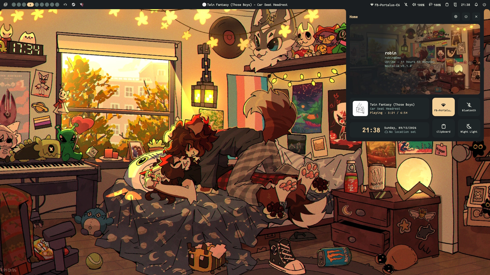

<h3 align="center">
   
  Evergarden for <a href="https://noctalia.dev">Noctalia</a>
</h3>

  
  
  

  

### Previews

  
Winter

  

  
Fall

  

  
Spring

  

  
Summer

  

### Usage

1. Download the variant of your choice from `themes/` to your
   [noctalia palette directory](https://docs.noctalia.dev/noctalia/theming/palette/#custom-palette-files)
   (usually `~/.config/noctalia/palettes/`)
2. Select the theme in the noctalia settings panel.

### Thanks to <3

- [robin](https://codeberg.org/comfysage)

  

